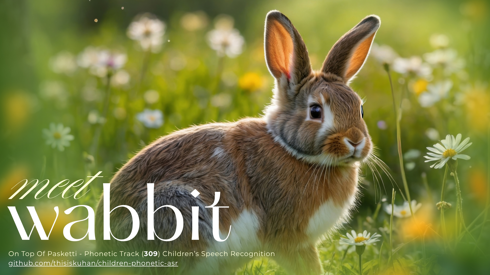
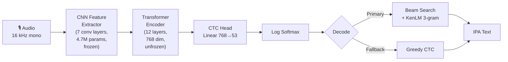
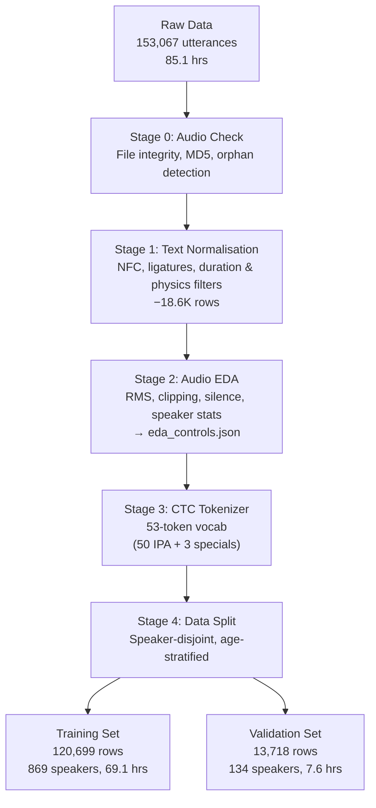

     

> [DrivenData — On Top of Pasketti](https://www.drivendata.org/competitions/309/childrens-phonetic-asr/) | Phonetic Track | [MIT](LICENSE)

> This repository is a squashed version of the original working repo, created to ensure data compliance and security. The full commit history and development version remain private at thisiskuhan/309.

My entry for the children's speech recognition competition — fine-tuning [WavLM Base+](https://huggingface.co/microsoft/wavlm-base-plus) (or Large) on ~85 hours of kids' speech to transcribe phonemes. I quit this competition twice before finally going all-in. Started at PER **~0.69**, pushed val down to **0.17** across 24 training runs — but the real test leaderboard never broke past **0.302**, with a best rank of **17th** and typically juggling between **20th–35th out of 430 participants**. The 3–4 year olds' poorly articulated, quiet recordings were the hardest part — and despite trying noise augmentation, pitch shifting, oversampling, SpecAugment tuning, SR-CTC, checkpoint averaging, and beam search with KenLM, I never figured out how to close that val-to-test gap. Stopped when I ran out of money to rent GPUs.

---

## Table of Contents

- [Why This Matters](#why-this-matters)
- [The Journey](#the-journey)
- [Architecture](#architecture)
- [Data Pipeline](#data-pipeline)
- [Training](#training)
- [Inference & Submission](#inference--submission)
- [Results](#results)
- [What Worked & What Didn't](#what-worked--what-didnt)
- [Discarded Approaches](#discarded-approaches)
- [Test Set Analysis](#test-set-analysis)
- [Project Structure](#project-structure)
- [Environment & Hardware](#environment--hardware)
- [Setup & Reproduction](#setup--reproduction)
- [Acknowledgements](#acknowledgements)
- [License](#license)

---

## Why This Matters

Most speech recognition is trained on adults. Kids sound different from adults — higher pitch, inconsistent articulation, irregular rhythms, incomplete words. Most voice assistants struggle with young children. This matters because voice could be significant for early education: screening for speech disorders, detecting dyslexia early, measuring reading fluency. But you can't build any of that if the model can't understand kids in the first place.

This [competition](https://www.drivendata.org/competitions/309/childrens-phonetic-asr/) (funded by the Gates Foundation) gives you two datasets of children's speech with IPA phonetic transcriptions and asks: can you build something that actually works?

- **DS1:** 12,043 files, 6.4 hrs — very quiet recordings, mostly 3–4 year olds
- **DS2:** 141,024 files, 78.6 hrs — clean studio recordings, mixed ages
- **114K orphan audio files** (~89 hrs) with no transcripts (potential free data)
- **Test set:** 77,011 utterances — you get an A100, 2 hours, no internet. Go.

---

## The Journey

### Early Attempts

I actually joined this competition twice before and quit both times. The first time, I looked at the IPA phonetic transcriptions and thought "I don't know anything about phonetics" and closed the tab. The second time, I got as far as downloading the data, poked around, felt overwhelmed by the audio processing side of things, and walked away again.

Third time was different. Something about it kept pulling me back. I told myself I'd just build a baseline — something simple — and see where it goes. That was a few weeks before the deadline.

I never did build something simple.

### Custom Training Loop

Instead of a baseline, I wrote a **2,370-line custom training loop** with three-stage progressive unfreezing — inspired by ULMFiT. The idea was the model would gradually learn: first just the CTC head, then the upper encoder layers, then the full model. It had EMA signal trackers, per-group warmup ramps, manual AMP with GradScaler, age-weighted CTC loss, and its own W&B background daemon.

I spent two weeks building it. Well-engineered, but ultimately unnecessary.

**Run 1** was the first real training. Rented an **RTX 5090** on RunPod, trained for 27 epochs across all three stages. PER: **0.4141**. Submitted to the leaderboard: **0.3528**. Not great. Post-mortem revealed three bugs: LR had silently hit zero (wrong total steps calc), GradScaler was collapsing in Stage 3, and throughput cratered from 285 to 41 samples/sec when the full model unfroze.

Runs 3 through 10 were me patching holes. Cosine LR floor, bf16 instead of fp16, SpecAug tuning. PER stuck around 0.33–0.35. I was spending more time debugging my training loop than improving the model.

### Migration to HF Trainer

Eventually I stared at the numbers long enough to see it: Stage 2 did all the work. The fancy stage transitions? Zero measurable benefit over just unfreezing everything with LLRD (layer-wise learning rate decay). Two weeks of clever engineering, and the answer was "just use HuggingFace Trainer."

So I rewrote the whole thing. 2,370 lines became ~1,900, most of it config and callbacks. Same results. A fraction of the complexity. The old code got renamed to `deprecated_sft_trainer.py` and eventually deleted.

**Run 11** — first HF Trainer run: **PER 0.282**. 32% better than the custom loop, with a fraction of the code.

### Augmentation & Hyperparameter Search

Now that I could iterate fast, I started experimenting properly:

- **Run 17**: Combined all augmentation techniques — MUSAN noise injection, room impulse responses, asymmetric pitch shifting (kids' voices pitch up more than down). PER **0.2586**. Augmentation hurts early on but pays off by epoch 8.

- **Run 20**: SR-CTC regularisation, LR floor, cranked batch size to 160. PER **0.2627** — worse than Run 17. Bigger batch size didn't help here.

- **Run 23**: Switched to an **RTX 3090** on RunPod to save money. Got 2 epochs in before running into issues. PER 0.3076. Incomplete.

### Per-Dataset SpecAugment Tuning

I'd been staring at the DS1-DS2 gap for days. DS1 is these tiny, quiet recordings of 3–4 year olds — already noisy at ~12 dB SNR. DS2 is clean studio audio. I was applying the same SpecAugment to both: `mask_time_prob=0.30`.

Then it clicked: I was *double-corrupting* DS1. The audio is already degraded — applying full SpecAugment on top was destroying the signal. Drop DS1 SpecAug to 0.15. That's it.

**Run 24** on an **RTX 4080 SUPER 16 GB** (cheapest GPU I'd rented so far): **val PER 0.2314** at epoch 23. The DS1-DS2 gap shrank from 0.13 to 0.10. Run 24 was ahead of every previous run at every single epoch.

I had more ideas. But my RunPod balance was gone.

Across all runs, my best val PER hit **0.17** — but the test leaderboard never budged past **0.302**. That’s nearly double the error on unseen data. The 3–4 year olds were the wall I couldn’t break through — garbled articulation, near-silent recordings, and an acoustic distribution the model just couldn’t learn to generalise on.

**Best val PER: 0.17. Best test PER: 0.302. Best rank: 17th; typically 20th–35th out of 430.** That's where my budget said stop — not where my ideas ran out.

---

## Architecture



| Component | Detail |
|-----------|--------|
| **Backbone** | WavLM Base+ (`microsoft/wavlm-base-plus`, MIT license) |
| **Total params** | 94.4M (89.7M trainable, CNN frozen) |
| **Encoder** | 12 transformer layers, hidden dim 768, fully unfrozen |
| **CNN** | 7 convolutional layers (4.7M params) — frozen throughout |
| **CTC head** | `nn.Linear(768, 53)`, randomly initialised |
| **Vocab** | 53 tokens: 50 IPA phonemes + `[PAD]` (CTC blank) + `[UNK]` + `\|` (word boundary) |
| **Precision** | bf16 training, fp16 inference |
| **LLRD** | Layer-wise LR decay = 0.85 — 12 layers for Base+, 24 for WavLM Large runs |

### Learning Rate by Layer

```
lm_head  → 3.0e-4   (full learning rate)
enc_L11  → 1.0e-4
enc_L6   → 4.4e-5   (× 0.85⁵)
enc_L0   → 1.7e-5   (× 0.85¹¹)
CNN      → 0.0      (frozen)
```

---

## Data Pipeline

All stages are orchestrated via `python pipeline.py --etl` and produce deterministic outputs.



### Stage 0 — Audio Check

Validates file existence, size, and optional MD5 hashes. Detects 114K orphan audio files in DS2 (~89 hrs of potential SSL data). Zero-cost insurance gate — no audio decoding, just `stat()` calls.

### Stage 1 — Text Normalisation

| Filter | What | Dropped |
|--------|------|---------|
| NFC + ligatures | `tʃ→ʧ`, `dʒ→ʤ`, `r→ɹ` | — |
| Whitespace squash | Double spaces → single | — |
| Run-on labels | No spaces + len > 15 | 373 |
| Short audio | < 0.5s (mic clicks, truncated files) | 5,821 |
| Long audio | > 16s (GPU memory policy) | 658 |
| Physics filter | Tokens-per-second outside [1, 25] | 426 |
| Short transcripts | < 3 phoneme characters | ~11K |
| Audio EDA | Load failures + duration mismatches | 4 |

**Result:** 153,067 → 134,434 (87.9% kept)

### Stage 2 — Audio EDA

Corpus-wide acoustic analysis → `eda_controls.json` driving training decisions: RMS normalisation (130× spread), silence detection, duration profiling, per-speaker/per-age stats, format validation (16 kHz mono).

### Stage 3 — CTC Tokenizer

Builds a deterministic `Wav2Vec2CTCTokenizer` with sorted vocabulary (Unicode codepoint order) for cross-machine reproducibility. Zero OOV guarantee — every character is validated against the IPA canonical inventory.

### Stage 4 — Data Split

| Property | Value |
|----------|-------|
| Method | Speaker-disjoint, age × dataset stratified |
| Train | 120,699 rows (869 speakers, 69.1 hrs) |
| Val | 13,718 rows (134 speakers, 7.6 hrs) |
| Phoneme coverage | 50/50 (guaranteed by retry loop) |
| Rare-phoneme speakers | 10 pinned to train |

---

## Training

### Configuration (Run 24 — Best)

| Parameter | Value |
|-----------|-------|
| Epochs | 25 (patience=5 early stopping) |
| Effective batch | 64 (physical=32 × accumulation=2) |
| Optimizer | AdamW, weight decay 0.015 |
| LR schedule | Cosine with linear warmup (1500 steps), floor at 10% of peak |
| Loss | CTC (mean reduction, `zero_infinity=True`) + SR-CTC (β=0.1) |
| Dropout | 0.1 across the board (attention, hidden, feat_proj, final, layerdrop) |
| SpecAugment | time=0.30 (DS2) / 0.15 (DS1), freq=0.12 |
| DS1 oversampling | 3× repeat |

### Augmentation Pipeline

Applied per-sample in the data collator during training:

| Step | Detail | Scope |
|------|--------|-------|
| Speed perturbation | [0.8, 1.2]× resampling | All datasets |
| MUSAN noise | SNR tiers: 5–10 dB (10%), 10–20 dB (30%), 20–25 dB (60%), p=0.50 | DS2 only |
| RIR convolution | Room impulse response, p=0.30 | DS2 only |
| Pitch shift | DS1: [−2, +6] st, DS2: [−2, +10] st (asymmetric toward child F0), p=0.35 | All datasets |
| Silence trimming | Leading/trailing at −40 dB, absolute floor 1e-4 | All datasets |
| CMVN normalisation | Zero-mean unit-variance normalisation | All datasets |
| SpecAugment | Time/frequency masking (applied by model config, not collator) | All datasets |

### Callbacks & Safety

- **Early stopping** — patience=5 on `eval_per`
- **OOM recovery** — catches CUDA OOM, clears cache, continues next batch
- **CTC constraint check** — verifies `output_len ≥ target_len` at first batch
- **VRAM cleanup** — `gc.collect()` + `torch.cuda.empty_cache()` between epochs
- **Email notifications** — alerts on completion, failure, or new best PER

---

## Inference & Submission

### Decode Pipeline

```
Audio → ThreadPool load (20 workers) → resample 16 kHz → silence trim → CMVN
     → Length-sorted, adaptive batch sizing (cap ~16.4M samples/batch)
     → WavLMForCTC forward (fp16 autocast)
     → UNK suppression (logits[:, :, 1] = −1e9)
     → Beam search + KenLM 3-gram LM (16-worker Pool)
        └── on failure → greedy CTC fallback
            └── on OOM → retry at halved batch size
     → IPA post-processing → submission.jsonl
```

### Beam Search Parameters

| Parameter | Value |
|-----------|-------|
| Beam width | 100 |
| LM weight (α) | 0.575 |
| Word insertion bonus (β) | 3.0 |
| Beam prune logp | −10.0 |
| Token min logp | −5.0 |
| LM | KenLM 3-gram, Witten-Bell smoothing, trained on gold transcripts |

### Submission Runtime

| Property | Value |
|----------|-------|
| Hardware | NVIDIA A100 80 GB, 24 vCPU, 220 GB RAM |
| Time limit | 2 hours, no network access |
| Test files | 77,011 utterances, 38.4 hrs |

### Build & Submit

```bash
# Average top-5 checkpoints
python submission/scripts/avg_checkpoints.py \
    data/models/hf_sft_checkpoints/checkpoint-{A,B,C,D,E} \
    --output submission/src/model/

# Build KenLM language model
python submission/scripts/build_arpa_lm.py

# Package
bash scripts/zip_submission.sh my_submission   # → submission/my_submission.zip
```

---

## Results

**Val PER: ~0.69 → 0.17** over 24 runs — a 75% relative improvement. But the test leaderboard told a different story: best submission scored **0.302**, best rank **17th**, typically juggling between **20th–35th out of 430 participants**. The val kept dropping; the test refused to follow. The 3–4 year olds' poorly articulated, quiet recordings were the gap I couldn't close.

| Where | Val PER | Test PER | What got us there |
|-------|---------|----------|-------------------|
| Run 1 E1 — start | ~0.69 | — | First epoch, custom trainer, pain |
| Run 1 — converged | 0.4141 | 0.3528 | 27 epochs, still buggy |
| Run 11 — rewrite | 0.2820 | — | Swallowed pride, used HF Trainer |
| Run 17 — augmentation | 0.2586 | — | Noise, reverb, pitch shifting |
| Run 24 — best run | 0.2314 | — | Stopped over-augmenting noisy data |
| **Best across all runs** | **0.17** | **0.302** | **The gap I couldn’t close** |

The gap between val (0.17) and test (0.302) is nearly 2× the error on unseen data — and nothing I tried could shrink it. The model’s main confusions are between neighbouring phoneme pairs (ɪ→i, ʌ→ə, ɛ→æ) — genuinely ambiguous even to human ears, but the test set’s acoustic distribution (younger children, quieter recordings, more silence) punished generalisation hard.

Breakdown by age tells you everything about this problem:

| Age | PER | |
|-----|-----|---|
| 3–4 | ~0.33 | Hardest — they barely articulate, audio is quiet |
| 5–7 | ~0.18 | Sweet spot — good data, clear-ish speech |
| 8–11 | ~0.16 | Clear articulation |
| 12+ | ~0.15 | Near-adult speech patterns |

---

## What Worked & What Didn't

### What Worked

| Technique | Impact |
|-----------|--------|
| **DS1 SpecAug reduction** (0.30→0.15) | Key insight for Run 24 — DS1 is already noisy, full SpecAug double-corrupts |
| **Beam search + KenLM 3-gram** | Significant improvement over greedy decode |
| **DS1 3× oversampling** | Balances noisy DS1 with clean DS2 |
| **LLRD** (decay=0.85) | Lower layers preserve general acoustics, upper layers adapt |
| **SR-CTC** (β=0.1) | Smooths blank-peaky CTC distributions via temporal KL |
| **Asymmetric pitch** | Children pitch UP more than down; matches child F0 distribution |
| **Full augmentation suite** | +0.15 PER at E1 but surpasses non-augmented by E8 |
| **Speaker-disjoint split** | Prevents voice leakage in validation |
| **LR floor** (10% peak) | Prevents dead steps at end of cosine schedule |

### What Didn't Help

| Technique | Outcome |
|-----------|---------|
| **Checkpoint averaging** | Top-5 avg PER 0.2315 vs single best 0.2314 — too similar |
| **Age-weighted CTC loss** | No improvement |
| **3-stage progressive unfreezing** | Replaced by simpler LLRD (same results, 500 fewer lines) |
| **Head-only warmup** | No measurable benefit over full-unfreeze from step 0 |
| **Larger effective batch** | 160 (Run 20) performed worse than 64 (Run 24) |
| **TTA (test-time augmentation)** | Logit averaging hurt PER; medoid voting marginal, not worth 3× cost |

---

## Discarded Approaches

### Three-Stage Signal-Driven SFT Trainer

A 2,370-line custom training loop (Runs 1–10) with three-stage progressive unfreezing (CTC head → upper encoder → full model), CNN unfreezing, EMA signal trackers, per-group warmup ramps, manual AMP with GradScaler, and age-weighted CTC loss. Stage 2 delivered most of the gains; stage transitions and CNN unfreezing added no benefit over full-unfreeze with LLRD. Replaced by HF Trainer wrapper at Run 11.

### SSL Continued Pre-Training

Self-supervised continued pre-training of WavLM on ~163 hrs of children's audio (including 114K unlabelled orphan files). Fully built (759 lines, 61 tests passing) and tried in an early run, but it didn't noticeably improve downstream SFT performance. The orphan data is free information in principle, but the SSL representations didn't transfer well enough to justify the extra GPU time.

### NST / Pseudo-Labelling

Teacher inference on orphan audio → confidence filtering → append to training data. Pipeline built and tested but not used in the best submission.

### WavLM Large (Executed — Overfit)

WavLM Large (316M params, 24 transformer layers) was fine-tuned in a few runs with LLRD across all 24 layers (decay=0.85). The model overfit — more parameters and a larger representational capacity amplified the mismatch between the clean, well-represented training distribution and the harder DS1/test-set conditions rather than improving generalisation. Regularisation (dropout, layerdrop, SpecAugment) that worked well for Base+ was insufficient to tame Large on this dataset size. Base+ generalised better overall and remained the backbone for all subsequent runs.

---

## Test Set Analysis

Detailed recon on test files revealed the test set is a **third distribution** — neither DS1 nor DS2. Volume levels, pitch range, and silence ratio all differ substantially from both training datasets.

**Key gaps:**

- **Volume dead zone:** A significant portion of test files sit in an RMS range barely represented in training — between DS1's very quiet recordings and DS2's clean studio audio
- **Younger children:** Test pitch characteristics suggest a higher proportion of young children than in the training data
- **High silence ratio:** Test files contain substantially more silence than training data
- **Quiet = noisy:** Quiet files also tend to have lower SNR, compounding the difficulty

---

## Project Structure

```
309/
├── src/                              # Training codebase
│   ├── pipeline.py                   # Orchestrator (--etl, --sft, --avg, --nst, --health)
│   ├── config/
│   │   └── config.yaml               # All hyperparameters
│   ├── etl/
│   │   ├── audio_check.py            # Stage 0: file integrity
│   │   ├── eda_processor.py          # Stages 1+2: text normalisation + audio EDA
│   │   ├── data_split.py             # Stage 4: speaker-disjoint split
│   │   └── model_selection_eda.py    # Acoustic diagnostics
│   ├── tokenizer/
│   │   └── tokenizer.py              # Stage 3: CTC vocab builder
│   ├── trainer/
│   │   ├── sft_trainer_hf.py         # HF Trainer wrapper (~1,900 lines)
│   │   ├── model.py                  # Model build, freeze, LLRD param groups
│   │   ├── data_collator.py          # Audio loading, augmentation, padding
│   │   ├── dataset.py                # JSONL manifest reader
│   │   ├── metrics.py                # PER, CER, phoneme recall, error analysis
│   │   └── email_callback.py         # Email alerts on completion/failure
│   ├── nst/                          # Noisy student training (built, unused in best run)
│   ├── utils/                        # JSON, audio, W&B tracking, benchmarks
│   └── tests/                        # Test suite (~6,200 lines)
│
├── submission/                       # Inference package
│   ├── src/
│   │   ├── main.py                   # Inference pipeline
│   │   ├── decode_beam_lm.py         # pyctcdecode + KenLM wrapper
│   │   ├── decode_greedy.py          # Tensor-op greedy decoder
│   │   └── unigrams.json             # Unigram vocabulary for beam search
│   ├── scripts/                      # Build helpers (avg checkpoints, build LM)
│   └── Dockerfile                    # Local CPU testing container
│
├── scripts/                          # Shell scripts & analysis tools
│   ├── provision_runpod.sh           # Cloud GPU provisioning
│   ├── zip_submission.sh             # Package submission → .zip
│   ├── zip_source.sh                 # Archive source for transfer
│   ├── per_dataset_audio_diagnostic.py
│   ├── sweep_lm_local.py
│   └── sweep_lm_weight.py
│
├── markdown/                         # Design documentation (8 numbered files)
├── data/                             # Competition data (not in repo — gitignored)
├── requirements.txt                  # Python dependencies
├── .env.example                      # Template for secrets
└── LICENSE                           # MIT
```

---

## Environment & Hardware

### Development

| Property | Value |
|----------|-------|
| **OS** | Ubuntu 22.04 LTS (local) / Ubuntu 22.04 (RunPod) |
| **Python** | 3.12 |
| **PyTorch** | 2.x + CUDA 12.4 |
| **Frameworks** | HuggingFace Transformers ≥4.40, torchaudio |

### Training GPUs Used

| GPU | VRAM | Where |
|-----|------|-------|
| NVIDIA RTX 3090 | 24 GB | RunPod |
| NVIDIA RTX 4080 SUPER | 16 GB | RunPod |
| NVIDIA RTX 4090 | 24 GB | RunPod |
| NVIDIA RTX 5090 | 32 GB | RunPod |

Total GPU spend across 24 runs: **~$100**. A single training run fits comfortably within **$4–7**.

### Inference Runtime (DrivenData)

| Property | Value |
|----------|-------|
| GPU | NVIDIA A100 80 GB PCIe |
| CPU | 24 vCPU |
| RAM | 220 GB |
| Time limit | 2 hours, no network |

---

## Setup & Reproduction

### Prerequisites

- Python 3.10–3.12
- CUDA-capable GPU (16+ GB VRAM recommended for training)
- Competition data (not included — obtained from [DrivenData](https://www.drivendata.org/competitions/309/childrens-phonetic-asr/))

### Data Format

The pipeline expects competition data under `data/raw/` with this layout:

```
data/raw/
├── 1_train_phon_transcripts.jsonl    # Dataset 1 — 12,043 utterances
├── 2_train_phon_transcripts.jsonl    # Dataset 2 — 141,024 utterances
├── 1_audio/                          # Dataset 1 audio files
│   └── U_<hex>.flac
├── 2_audio/                          # Dataset 2 audio files (~255K files, includes orphans)
│   └── U_<hex>.flac
└── train_word_transcripts.jsonl      # Word-level transcripts (not used in phonetic track)
```

Each JSONL file has one JSON object per line with these fields:

| Field | Type | Example |
|-------|------|---------|
| `utterance_id` | string | `U_<hex_id>` |
| `child_id` | string | `C_<hex_id>` |
| `session_id` | string | `S_<hex_id>` |
| `audio_path` | string | `audio/U_<hex_id>.flac` |
| `audio_duration_sec` | float | `1.435` |
| `age_bucket` | string | `3-4` \| `5-7` \| `8-11` \| `12+` \| `unknown` |
| `md5_hash` | string | `<hex_hash>` |
| `filesize_bytes` | int | `121365` |
| `phonetic_text` | string | `<IPA transcription>` |

**Audio files** are FLAC, 16-bit, mono, 44.1 kHz. The pipeline resamples everything to 16 kHz during ETL. File names follow the pattern `U_<16-char hex hash>.flac`, matching the `utterance_id` in the transcript.

**Naming convention** — `config.yaml` defines `datasets: [1, 2]`. Each key maps to `{key}_train_phon_transcripts.jsonl` and `{key}_audio/`. If you add a third dataset, just add `3` to the list and follow the same naming pattern.

**Note:** Dataset 2's audio directory contains ~114K orphan files (audio without matching transcripts). The EDA step detects and logs these — they're filtered out before training.

### Installation

```bash
# 1. Clone and enter
git clone <repo-url> && cd 309

# 2. Create virtual environment
python -m venv venv && source venv/bin/activate

# 3. Install PyTorch (CUDA 12.4)
pip install torch torchaudio --index-url https://download.pytorch.org/whl/cu124

# 4. Install dependencies
pip install -r requirements.txt

# 5. Copy and fill in secrets
cp .env.example .env
# Edit .env with your W&B key, email credentials, etc.
```

### Running the Pipeline

```bash
cd src/

# Health check — verify dependencies, data, config
python pipeline.py --health

# Full ETL (audio check → text normalisation → audio EDA → tokenizer → data split)
python pipeline.py --etl

# Train (WavLM Base+ CTC fine-tuning)
python pipeline.py --sft

# Average top-5 checkpoints
python pipeline.py --avg

# Build submission
cd ..
bash scripts/zip_submission.sh
```

### Cloud Provisioning (RunPod)

```bash
# Download data archives from Google Drive
bash scripts/provision_runpod.sh 123   # digits = which archives to download
```

---

> **A note on consistency:** This repo evolved over 24 training runs. Config settings changed between runs, so numbers in the `markdown/` docs, logs, and reports may not all agree — they reflect different pipeline snapshots. When in doubt, the [Run 24 artifacts](study/runs/run_24/) are the ground truth for the final submission.

---

## Acknowledgements

- **Competition:** [DrivenData](https://www.drivendata.org/) — On Top of Pasketti: Children's Speech Recognition Challenge
- **Funding:** [Gates Foundation](https://www.gatesfoundation.org/), [Valhalla Foundation](https://valhalla.org/), [TeachFX](https://teachfx.com/), [UMD EDSI](http://edsi.umd.edu/)
- **Base model:** [WavLM Base+](https://huggingface.co/microsoft/wavlm-base-plus) (Microsoft, MIT license)
- **SR-CTC:** Yao et al., "Self-Regularised CTC", ICLR 2025
- **Augmentation data:** MUSAN noise corpus, RIR impulse responses
- **Decode:** [pyctcdecode](https://github.com/kensho-technologies/pyctcdecode) + [KenLM](https://kheafield.com/code/kenlm/)

---

## License

MIT — see [LICENSE](LICENSE).

Competition training data is **not** included in this repository and is **not** covered by the MIT license. All competition data is subject to [DrivenData's competition rules](https://www.drivendata.org/competitions/309/childrens-phonetic-asr/rules/) and must be deleted after the competition unless separately licensed.

---

Twenty-four runs. Two quits. Best val: 0.17. Best test: 0.302. Best rank: 17th out of 430. If you can see what I missed, I'd genuinely love to know.

*Work by Kuhan, with assistance from Claude.*
